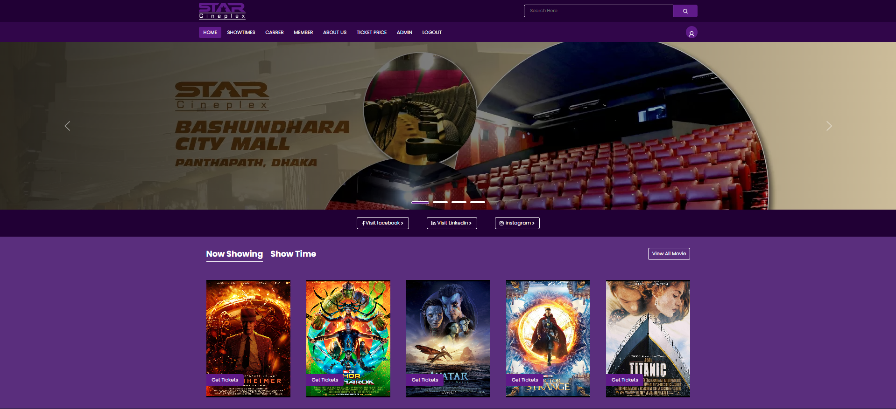

## Live Preview

```console
 https://ticket-booking-client-vite.onrender.com
```

***Login as Admin***

```console
   email : sajibshikder78971@gmail.com
   password : asdfg
```

***User Login Access***

```console
   email : user@gmail.com
   password : asdfg
```

## Installation or Download Project

Open Terminal (Git Bash)

```console
 git clone https://github.com/DEVELOPERxSAJIB/ticket-booking.git
```

## Quick Start

The quickest way to get started with StarPlex tickting app is in details here

 **Change dir & Install dependencies or Node_modules :**

server -> Run this command 1 by 1
```console
  cd server/ 
  npm install
  npm start
```

client -> open another terminal & run this command 1 by 1
```console
 cd client/
 npm install
 npm run dev
```

Finishing this commands will run the application in your machine as Development mode. View the website at: http://localhost:5173

## After open in browser
***Login as Admin***

```console
   Id : sajibshikder78971@gmail.com
   password : asdfg
```
Gain administrative control and access to the application's dashboard with this feature. Enjoy the ability to update Movies, Track theatre details, Delete Movies, Update movies, and perform various other administrative tasks. This functionality enhances your control and management capabilities within the application.

***Also create your own account***
```console
   http://localhost:5173/register
```
Visit this url so you can Register as new user and enjoy the features
 
+ Create your own Theate or Hall
+ Sell your Tickets to your client
+ You can also book a Ticket for yourself
+ Make your payment with Stripe
+ Book the Seat position you like

And much more features are available in the full application. You can explore more by yourself


**For additional information, feel free to reach out to me on LinkedIn. Visit my LinkedIn profile [here](https://www.linkedin.com/in/mdsajibshikder/) for further discussions and inquiries.**

